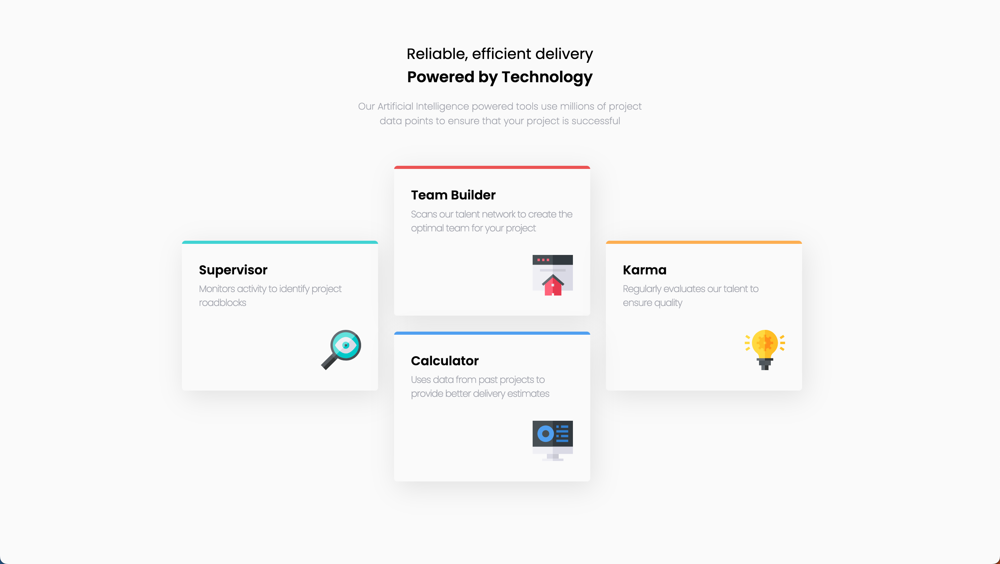
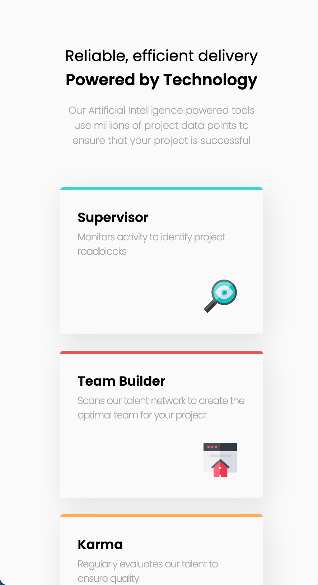

# Frontend Mentor - Four card feature section solution

This is a solution to the [Four card feature section challenge on Frontend Mentor](https://www.frontendmentor.io/challenges/four-card-feature-section-weK1eFYK). Frontend Mentor challenges help you improve your coding skills by building realistic projects.

## Table of contents

- [Overview](#overview)
  - [The challenge](#the-challenge)
  - [Screenshot](#screenshot)
  - [Links](#links)
- [My process](#my-process)
  - [Built with](#built-with)
  - [What I learned](#what-i-learned)

## Overview

### Screenshot

#### Desktop View:



#### Mobile View:



### Links

- Live Site URL: [Live Demo](https://jerryren527.github.io/four-card-feature-section/)
- Figma File: [Personal Figma File](https://www.figma.com/file/qqBRXKEd6pxTGDV2q0DFty/four-card-feature-section?t=uGAGN7NLJdSpYeEP-0)

## My process

### Built with

- HTML
- CSS
- PostCSS
- Flexbox

### What I learned

`position: relative` means that the element is positioned according to the normal flow of the document, and then offset relative to itself based on the values of `top`, `right`, `bottom`, and `left`.

---

Use relative units, such as `rem` and `em`, instead of `px`. Relative units honor unit preferences, such as the user's browser's default font size.

- `rem` stands for "root em". It is a unit of measure relative to the root element's font-size.
- `em` is a unit of measure relative to the the size of the element's parent.

---

#### Installing PostCSS plugins in Vite app

1. create a vite app. Vite uses PostCSS under the hood, so the `postcss` and `postcss-cli` do not need to be installed.

2. You only need to manually create your own config files and install PostCSS plugins.

3. Install postcss-preset-env plugin, which allows you to use future CSS syntax in your project:

```
npm i -D postcss-preset-env
```

4. create postcss.config.js:

> postcss.config.js

```js
import postcssPresetEnv from "postcss-preset-env";

export default {
  plugins: [postcssPresetEnv({ stage: 1 })],
};
```

5. run `npm run dev`

PostCSS video: [link](https://youtu.be/ohJcZW60br0)
